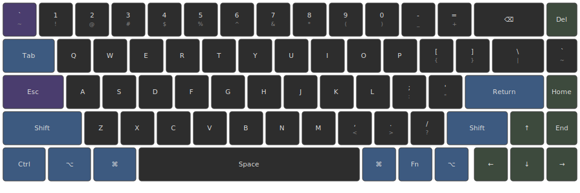
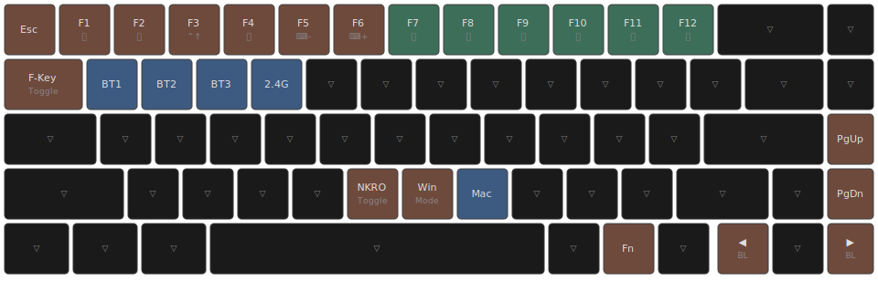

# Lofree Flow2 Keyboard Configuration

Configuration files for the [Lofree Flow2](https://www.lofree.co/products/lofree-flow-the-smoothest-mechanical-keyboard) mechanical keyboard, managed via [Via](https://www.caniusevia.com/).

## Files

| File                           | Purpose                                                             |
| ------------------------------ | ------------------------------------------------------------------- |
| `lofree.flow2.definition.json` | Physical keyboard definition for Via (key positions, sizes, matrix) |
| `lofree.layout.json`           | Keymap configuration (what each key does on each layer)             |
| `layer0-mac-base.svg`          | Visual diagram of Layer 0 (Mac base layer)                          |
| `layer1-mac-fn.svg`            | Visual diagram of Layer 1 (Mac Fn layer)                            |

## Usage

1. Open [Via](https://usevia.app/) in a Chromium-based browser
2. Connect your Lofree Flow2 keyboard
3. Load `lofree.flow2.definition.json` as a custom definition (if not auto-detected)
4. Import `lofree.layout.json` to apply the keymap
5. After making changes, export the layout to update `lofree.layout.json`

## Layout Overview

This configuration uses 6 layers:

- **Layer 0**: Mac base layer
- **Layer 1**: Mac Fn layer (media, brightness, Bluetooth)
- **Layer 2**: Windows base layer
- **Layer 3**: Windows Fn layer
- **Layer 4**: System layer (reset, EEPROM clear)
- **Layer 5**: Additional functions

### Custom Remaps

| Key                     | Original    | Remapped To                |
| ----------------------- | ----------- | -------------------------- |
| Top-left (Esc position) | `Esc`       | `` ` ~ `` (backtick/tilde) |
| Caps Lock               | `Caps Lock` | `Esc`                      |
| Fn + Top-left           | `Esc`       | `Esc`                      |

## Layer 0 — Mac Base

**Color Legend:**

- 🟪 Purple: Remapped keys (backtick, Esc)
- 🟦 Blue: Modifier keys
- 🟩 Green: Navigation keys

## Layer 1 — Mac Fn Layer

**Color Legend:**

- 🟫 Brown: Function keys (F1-F12)
- 🟩 Green: Media controls
- 🟦 Blue: Bluetooth/wireless switching
- ⬛ Dark: Transparent (falls through to Layer 0)

**Symbol:** ▽ = Transparent key

## Key Codes Reference

| Code                | Description                                    |
| ------------------- | ---------------------------------------------- |
| `KC_TRNS`           | Transparent - falls through to layer below     |
| `KC_NO`             | No action                                      |
| `MO(n)`             | Momentary layer switch (hold to activate)      |
| `TO(n)`             | Toggle to layer n                              |
| `CUSTOM(n)`         | Vendor-specific function                       |
| `0x77xx`            | Bluetooth/wireless switching (vendor-specific) |
| `RESET`             | Enter bootloader mode                          |
| `QK_CLEAR_EEPROM`   | Clear keyboard EEPROM                          |
| `MAGIC_TOGGLE_NKRO` | Toggle N-key rollover                          |

## Bluetooth Switching

| Key Combo | Function             |
| --------- | -------------------- |
| Fn + Q    | Bluetooth Profile 1  |
| Fn + W    | Bluetooth Profile 2  |
| Fn + E    | Bluetooth Profile 3  |
| Fn + R    | 2.4GHz Wireless Mode |

## Mode Switching

| Key Combo | Function                         |
| --------- | -------------------------------- |
| Fn + B    | Toggle NKRO (N-Key Rollover)     |
| Fn + N    | Switch to Windows mode (Layer 2) |
| Fn + M    | Switch to Mac mode (Layer 0)     |

## Special Functions

| Key Combo                   | Function                              |
| --------------------------- | ------------------------------------- |
| Fn + Tab                    | Toggle F-key row (show F1-F12 labels) |
| Fn + 3                      | Mission Control                       |
| Fn + ←                      | Backlight mode previous               |
| Fn + →                      | Backlight mode next                   |
| Fn + Shift + Backspace (3s) | Factory reset (hold for 3 seconds)    |
